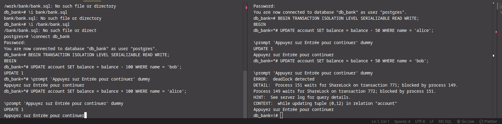
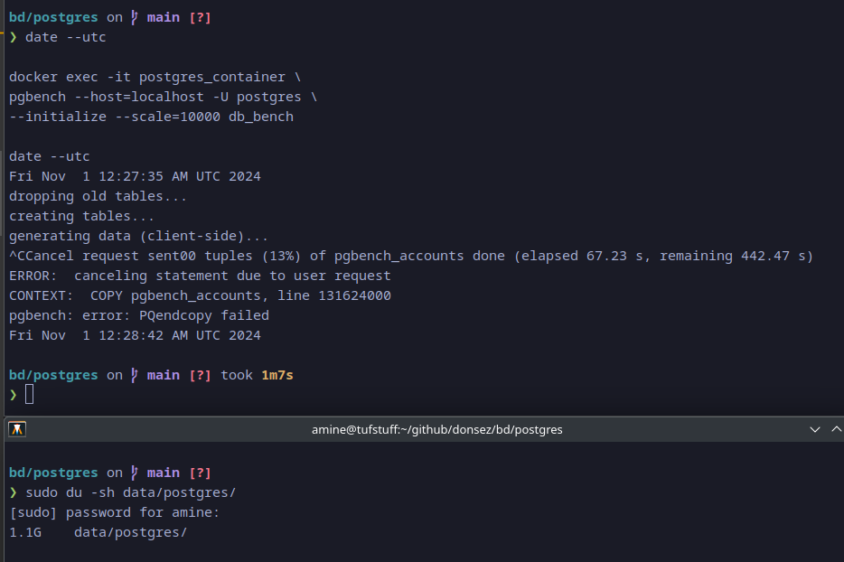
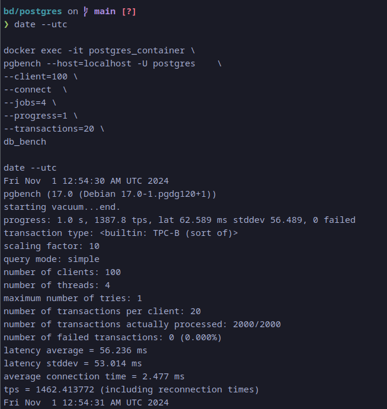
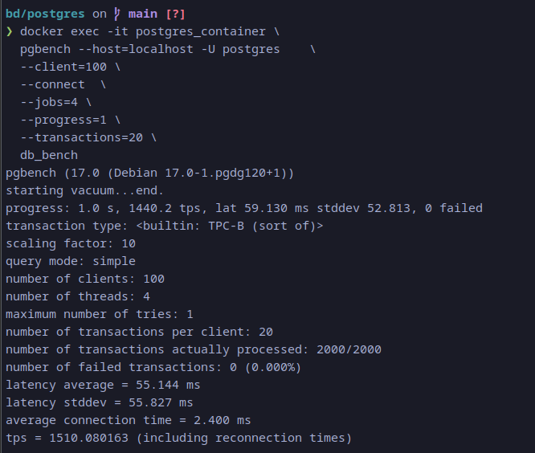
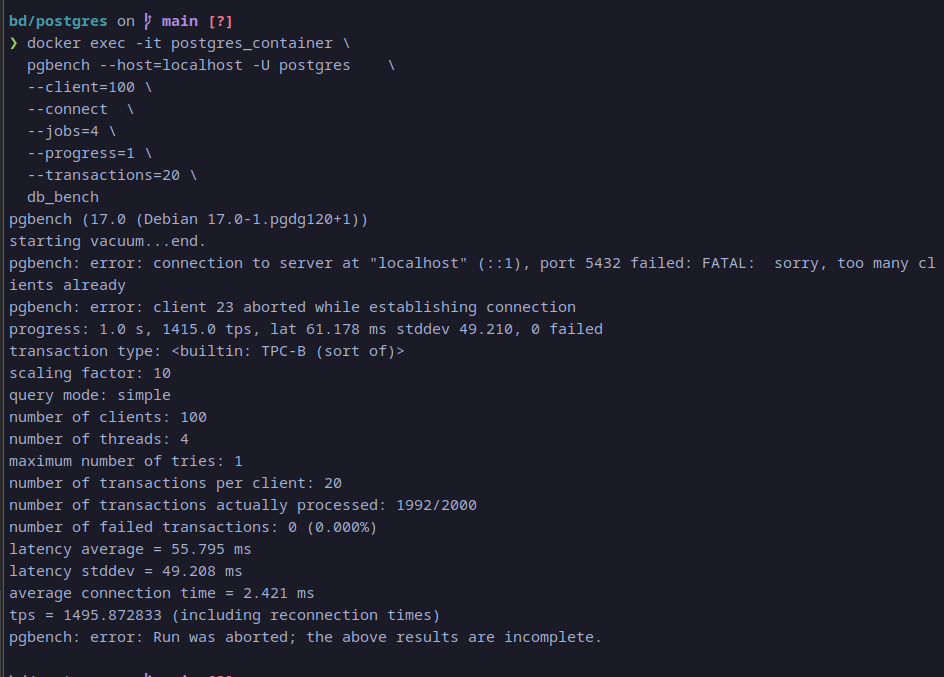

## partie 3 : transactions

### code de deux transaction debit-credit dont l'execution entraine une situation d'interblocage.

```sql
-- Session 1, etape 1
UPDATE account SET balance = balance - 100 WHERE name = 'bob';

\prompt 'Appuyez sur Entree pour continuer' dummy

-- Session 2, etape 1
UPDATE account SET balance = balance - 50 WHERE name = 'alice';

\prompt 'Appuyez sur Entree pour continuer' dummy


-- Session 1, etape 2
UPDATE account SET balance = balance + 100 WHERE name = 'alice';

\prompt 'Appuyez sur Entree pour continuer' dummy


-- Session 2, etape 2
UPDATE account SET balance = balance + 50 WHERE name = 'bob';

\prompt 'Appuyez sur Entree pour continuer' dummy
```

### la trace de la console des 2 transactions.



## partie 4 :






